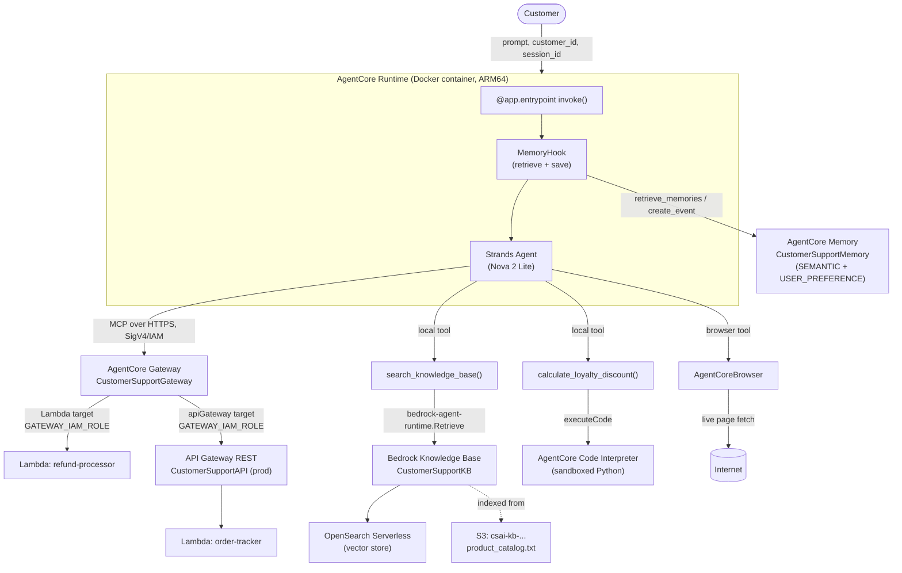
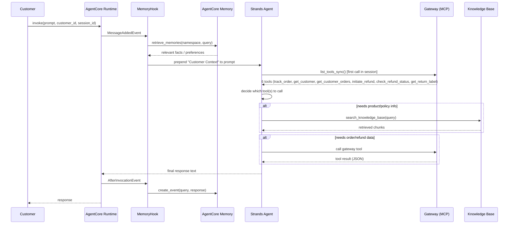

# Customer Support AI Agent — Amazon Bedrock AgentCore

An AI-powered customer support agent for an e-commerce platform, built with **Amazon Bedrock AgentCore** and the **Strands Agents SDK**. The agent handles order tracking, refund processing, product/policy Q&A via RAG, loyalty discount calculations, cross-session memory, and live web browsing — all through a single conversational interface deployed to AgentCore Runtime.

- **Region:** `us-east-1`
- **Model:** Amazon Nova 2 Lite (`global.amazon.nova-2-lite-v1:0`)

---

## 1. Architecture

## 2. Request Flow (single turn)

## 3. Infrastructure Inventory

| Component               | Resource Name                                           | Identifier                                                        |
| ----------------------- | ------------------------------------------------------- | ----------------------------------------------------------------- |
| Lambda (refund)         | `refund-processor`                                      | `arn:aws:lambda:us-east-1:376582749663:function:refund-processor` |
| Lambda (orders)         | `order-tracker`                                         | `arn:aws:lambda:us-east-1:376582749663:function:order-tracker`    |
| Lambda exec. role       | `csai-lambda-exec-role`                                 | —                                                                 |
| API Gateway REST        | `CustomerSupportAPI`                                    | `dj5t4oj31a` (stage `prod`)                                       |
| AgentCore Gateway       | `CustomerSupportGateway`                                | `customersupportgateway-b9gttgnahv`                               |
| Gateway auth            | AWS_IAM (SigV4)                                         | —                                                                 |
| Gateway service role    | `csai-gateway-service-role`                             | —                                                                 |
| Gateway target (Lambda) | `refund-processor`                                      | `initiate_refund`, `check_refund_status`, `get_return_label`      |
| Gateway target (API GW) | `order-tracker`                                         | `track_order`, `get_customer`, `get_customer_orders`              |
| S3 (KB source)          | `csai-kb-376582749663`                                  | `product_catalog.txt`                                             |
| Knowledge Base          | `CustomerSupportKB`                                     | `7OFTEF8RM8`                                                      |
| Embeddings model        | Titan Text Embeddings V2                                | `amazon.titan-embed-text-v2:0`                                    |
| Vector store            | OpenSearch Serverless                                   | auto-created via Bedrock console                                  |
| AgentCore Memory        | `CustomerSupportMemory`                                 | `CustomerSupportMemory-eqZNti4pgZ`                                |
| Memory strategy 1       | `customer_facts` (SEMANTIC)                             | namespace `cs_agent/{actorId}/facts`                              |
| Memory strategy 2       | `customer_preferences` (USER_PREFERENCE)                | namespace `cs_agent/{actorId}/preferences`                        |
| Runtime execution role  | `AmazonBedrockAgentCoreSDKRuntime-us-east-1-d0cb11a8b3` | —                                                                 |
| ECR repository          | `bedrock-agentcore-csai_agent`                          | —                                                                 |

## 4. `main.py` — TODO-to-Rubric Mapping

| TODO | Implements                                                                                                                    | Rubric criterion     |
| ---- | ----------------------------------------------------------------------------------------------------------------------------- | -------------------- |
| 1    | `BedrockAgentCoreApp()` instance                                                                                              | App initialization   |
| 2    | Config values loaded from `.env` via `python-dotenv`                                                                          | Configuration        |
| 3    | `BedrockModel`, `MemoryClient`, boto3 `bedrock-agent-runtime` client                                                          | Model & Clients      |
| 4    | `get_namespaces()` — maps strategy type → namespace template                                                                  | Namespace helper     |
| 5    | `MemoryHook` — retrieves context before each turn, saves after                                                                | Cross-session memory |
| 6    | `search_knowledge_base()` — calls `Retrieve` API on the KB                                                                    | RAG                  |
| 7    | `calculate_loyalty_discount()` — runs arithmetic in Code Interpreter, with a tier-only fallback                               | Code Interpreter     |
| 8    | `invoke()` entrypoint — wires Memory, Gateway (MCP over IAM), KB tool, discount tool, and `AgentCoreBrowser` into one `Agent` | Full integration     |

**Note on Gateway authentication:** the project was configured with `authorizer-type AWS_IAM` (SigV4) rather than Cognito/OAuth, so the boilerplate `streamable_http_client` import was replaced with `aws_iam_streamablehttp_client` from the `mcp-proxy-for-aws` package, which signs Gateway requests with the Runtime's execution-role credentials.

## 5. Local Development

- **Package manager:** `uv` (Python 3.14 virtual environment)
- **Task automation:** `Makefile` (GNU Make on Windows, `.RECIPEPREFIX := >`) with targets for IAM role creation, Lambda packaging/deploy, API Gateway permissions/deploy and testing
- **Secrets:** all AWS resource identifiers (`GATEWAY_URL`, `KB_ID`, `MEMORY_ID`, etc.) are kept in a local `.env` file, loaded via `python-dotenv`, and excluded from both git (`.gitignore`) and the Docker build context (`.dockerignore`)

## 6. Deployment

Deployed via the `agentcore` CLI (`bedrock-agentcore-starter-toolkit`) using **`agentcore deploy --local-build`** (Docker Desktop build on Windows) rather than the default CodeBuild path, after CodeBuild's `PROVISIONING` phase consistently stopped with no logs — consistent with a sandbox account restriction on privileged ARM64 builds.

Runtime configuration values are injected as **Runtime environment variables** via `--env KEY=VALUE` flags at deploy time (not baked into the image), keeping the container image free of secrets while still making the values available to `os.getenv(...)` inside the running container.

### Issues resolved during deployment (chronological)

1. **`nest_asyncio` + Python 3.14 + `anyio` incompatibility** — caused `TypeError: cannot create weak reference to 'NoneType' object`. Removed; not needed once `app.run()` vs. CLI `main()` was used correctly.
2. **Corrupted `.env`** — a `PowerShell Out-File` without a trailing newline caused a later `Add-Content` line to concatenate onto the same line as `GATEWAY_URL`, producing an invalid Gateway URL. Rebuilt `.env` from a clean array with `Set-Content`.
3. **`setuptools` flat-layout error** on `uv pip install .` inside the Docker build — `lambda/` and `evidence/` were mistaken for additional top-level packages. Fixed by pinning `[tool.setuptools] py-modules = ["main"]` in `pyproject.toml`.
4. **`container_runtime: none` stuck in `.bedrock_agentcore.yaml`** from an earlier failed detection attempt, which silently overrode Docker auto-detection even though Docker Desktop was running correctly. Fixed by editing the YAML directly.
5. **`MEMORY_ID=None` at runtime** — `.env` is (correctly, for security) excluded from the Docker build via `.dockerignore`, so `main.py` had no configuration inside the container. Fixed by passing config via `agentcore deploy --env KEY=VALUE`.
6. **`403 Forbidden` calling the Gateway** — the auto-generated Runtime execution role had Memory, Code Interpreter, and Bedrock Model permissions, but no `bedrock-agentcore:InvokeGateway` action (the toolkit cannot infer which Gateway a hand-written agent will call). Fixed with an inline IAM policy scoped to the specific Gateway ARN.

## 7. Test Evidence

Evidence stored under `evidence/` per rubric checklist item.

| Test                     | Prompt                                                           | Result                                                                                    | Evidence                                      |
| ------------------------ | ---------------------------------------------------------------- | ----------------------------------------------------------------------------------------- | --------------------------------------------- |
| 1 — Order Tracking       | "Can you track order ORD-001?"                                   | ✅ PASS — SHIPPED, `TRK987654321`, UPS, ETA returned                                      | `evidence/test1_order_tracking/output.txt`    |
| 2 — Refund Processing    | "...Kindle Paperwhite (ORD-002)... initiate a refund."           | ✅ PASS — `REF-ZE3EVPIS`, APPROVED, "3-5 business days"                                   | `evidence/test2_refund_processing/output.txt` |
| 3 — Knowledge Base (RAG) | "What are the benefits of the Platinum loyalty tier?"            | ✅ PASS — - Free same-day shipping ,15% discount on purchases , Priority customer support | `evidence/test3_knowledge_base/output.txt`    |
| 4 — Long-Term Memory     | Session A: "Hi, I am Jane..." → Session B: "Do you remember...?" | ✅ PASS — recalled name "Jane" and concise-response preference across sessions            | `evidence/test4_memory/output.txt`            |
| 5 — Loyalty Discount     | "Gold member, 4250 points, $150 order..."                        | ✅ PASS — 4000 pts redeemed, Gold 10%, final **$99.00**, remaining 349 pts                 | `evidence/test5_loyalty_discount/output.txt`  |
| 6 — Browser Tool         | "Go to amazon.com and tell me the page title."                   | ✅ PASS (tool executed) — returned a live page title from Amazon                          | `evidence/test6_browser/output.txt`           |

### Known Issues / Limitations

- **Test 5 (Loyalty Discount):** an earlier invoke reported **$100 / $54** because PowerShell expanded `$150` out of the JSON before it reached the agent. Re-invoking with `$150` preserved (`evidence/test5_loyalty_discount/payload.json`) yields **order total $150.00, final $99.00**. `main.py` now also extracts an explicit USD amount from the prompt so the model does not default `order_total` to 100 (requires a Runtime redeploy to take effect in AgentCore).
- **Test 6 (Browser):** the returned page title ("Sorry! Something went wrong!") reflects Amazon's bot-detection page, not an error in the Browser Tool — the tool itself successfully rendered a live page and extracted its title, which satisfies the rubric's technical requirement.

---

## Task 8 — Reflection

**Design decision.** I chose **IAM/SigV4 authentication (`AWS_IAM`)** for the AgentCore Gateway instead of Cognito/OAuth. In a single-developer project inside one AWS account, SigV4 reuses credentials that already exist (the Gateway service role outbound, the Runtime execution role inbound) instead of standing up a Cognito User Pool just to mint tokens. The cost was swapping the boilerplate `streamable_http_client` import for `aws_iam_streamablehttp_client` from `mcp-proxy-for-aws`. MCP Inspector only speaks Bearer tokens, so I verified the Gateway with a small signing script instead. For multi-tenant production I would move to Cognito, because IAM roles do not map cleanly to individual shoppers.

**Challenge.** The hardest problem was the deployment path, not agent logic. `agentcore deploy` in CodeBuild mode stopped during `PROVISIONING` with no logs — consistent with the AWS Academy/Vocareum sandbox blocking privileged ARM64 builds. `--local-build` unblocked that, then exposed a chain of smaller issues: a stale `container_runtime: none` in `.bedrock_agentcore.yaml`, a `setuptools` flat-layout error from `lambda/` and `evidence/` at the project root, `MEMORY_ID=None` because `.env` is correctly excluded from the Docker context, and a Gateway `403` because the auto-generated Runtime role had no `InvokeGateway` permission. Each fix came from CloudWatch or a `ParamValidationError`. That reinforced reading the actual exception, not just “it failed,” when several IAM and network layers sit between you and the agent.

**Production consideration.** Test 5 first failed because PowerShell stripped `$150` from the invoke JSON, so the model never saw the real total. I would still add a confirmation step around `calculate_loyalty_discount()` so a missing or defaulted `order_total` cannot silently change the bill. I would also move configuration from `--env` flags and `.env` files into Secrets Manager or Parameter Store, and tighten the Runtime execution role to the specific Gateway, Memory, and Knowledge Base ARNs it needs (already done for `InvokeGateway`) instead of the default `foundation-model/*` grant.
